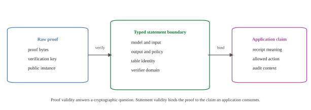

# Appendix: Statement Validity for zkML Proof Artifacts

**Companion note for**  
`Proof-Pressure Boundaries for STARK-Native Transformer Inference`

*May 2026 draft*

## Abstract

Proof verification and application validity are not the same layer. A proof can
verify against its verifier relation and public instance while the surrounding
application attaches the proof to the wrong model, input, output, numeric
policy, table identity, verifier domain, or deployment event. In zkML systems,
this gap matters because proof artifacts are often consumed as receipts by
agents, markets, governance processes, audit systems, and other software that
acts on the proof's asserted meaning.

This appendix describes a typed statement boundary for zkML proof artifacts. We
use **Tablero** as the name for the envelope pattern: proof bytes plus the
statement they are allowed to mean, the verifier domain in which they are valid,
the source handles that produced them, and the replay dependencies the next
layer is allowed to skip. The contribution here is not a new proving protocol.
It is a boundary discipline for making proof artifacts safe to compose.

This note complements the proof-pressure paper. Proof-pressure boundaries choose
where transformer work should be fused or split for proof-size reasons. Statement
boundaries specify what each resulting proof artifact certifies.

---

## 1. Motivation

A raw proof verifier answers a narrow question:

> Does this proof verify for this verifier relation and this public instance?

A zkML application usually asks a wider question:

> Does this artifact justify this application claim about this model, this input,
> this output, this numeric policy, and this deployment event?

Those are different questions. The first is cryptographic proof validity. The
second is statement validity.

The difference is easy to miss because successful proof verification is often
the most visible event in a demo. But a production receipt usually carries more
meaning than the proof relation alone. A proof may verify and still be
misattached to:

- a different model checkpoint;
- a different prompt or input commitment;
- a different output;
- a different quantization or lookup-table policy;
- a different verifier domain;
- a different action or deployment context.

This appendix treats that mismatch as a first-class systems problem.

---

## 2. Boundary Model

Figure 1 separates the three layers.



The raw proof layer contains the proof bytes, verification key or verifier
handle, and public instance. It is the layer checked by the proof verifier.

The typed statement boundary binds the proof to the facts the application is
allowed to assert: model surface, input, output, numeric policy, table identity,
verifier domain, source handles, and replay dependencies. This is the Tablero
layer.

The application claim is the decision or receipt that downstream software
consumes. It may be an audit record, an agent step, a settlement object, or an
authorization event. It should depend on the typed statement boundary, not on
raw proof verification alone.

---

## 3. What the Boundary Must Bind

For zkML proof artifacts, a statement boundary should bind at least the following
fields when they are part of the application claim.

| field | reason |
|---|---|
| verifier domain | prevents accepting a proof under the wrong verifier context |
| proof relation or backend handle | identifies the exact relation being verified |
| model identifier or model surface | prevents relabeling one model as another |
| input commitment | binds the proof to the claimed input or prompt |
| output commitment | binds the proof to the claimed output |
| numeric policy | binds quantization, range, rounding, and approximation assumptions |
| lookup-table identity | binds table membership proofs to the intended table |
| source artifact handles | connects proof artifacts to the source objects they summarize |
| replay dependencies | states which reconstruction work later layers may skip |
| scope metadata | records what the artifact does and does not certify |

The exact field set is application-specific. The important rule is that the
boundary must bind every public fact the next layer is allowed to rely on.

---

## 4. Example: Verifying the Wrong Claim

Consider a scoped attention proof that verifies a bounded Softmax-table
membership relation. The proof may correctly show that the committed rows obey
the relation and that the declared table membership checks pass.

That does not automatically prove the following wider statement:

> This production model, on this user prompt, produced this output under this
> deployment policy.

To justify that wider statement, the application needs additional bindings:
model identity, input commitment, output commitment, numeric policy, table
identity, verifier domain, and the exact proof artifact being consumed. Without
those bindings, a valid proof can become a valid-looking fragment attached to a
stronger claim.

This is the same distinction high-assurance systems already make between a
component check and a certified operational claim. A component can pass its local
test while the full system claim is false because the wrong component version,
configuration, input, or operational context was used. zkML receipts have the
same structure.

---

## 5. Relation to Proof-Pressure Boundaries

The proof-pressure paper studies where transformer work should share a proof
object. It reports a proof-size scaling pattern: lookup and trace work can grow
quickly while fused proof bytes grow slowly when attention arithmetic and
lookup-heavy table membership share one STARK-native proof object.

That result is a proof-architecture result. It does not remove the need for a
statement boundary. If the transformer surface is split across several proof
objects, typed boundaries preserve the claim across those objects. If the surface
is fused into one larger proof object, the fused artifact still needs a typed
statement boundary that says what the proof is allowed to mean.

The two ideas are therefore complementary:

- proof-pressure boundaries choose efficient proof structure;
- Tablero-style statement boundaries preserve application meaning.

---

## 6. Minimal Acceptance Rule

A verifier or application should not accept a zkML proof artifact only because
the raw proof verifies. It should accept only when both conditions hold:

1. `Verify(proof, verifier_domain, public_instance) = true`.
2. `Validate(statement_boundary) = true`, where the boundary binds the proof
   artifact to the claimed model, input, output, numeric policy, table identity,
   verifier domain, source handles, and allowed replay skips.

This rule is deliberately simple. Its purpose is to prevent a category error:
using proof verification as if it were a complete application statement.

---

## 7. Limits

This appendix does not introduce a new cryptographic proof system. It does not
claim that existing proof systems are unsound. It does not prescribe one global
receipt schema for every zkML application. It also does not replace application
security review, model provenance, or deployment policy.

The claim is narrower: when a proof artifact is used as a zkML receipt, the
statement boundary should be explicit, typed, and bound to the proof. Without
that boundary, proof validity can be mistaken for a stronger application claim.

---

## 8. Reproduction

Generate the figure:

```bash
python3 scripts/paper/generate_zkml_statement_validity_figure.py
```

The generator writes:

- `docs/paper/figures/zkml-statement-validity-boundary-2026-05.svg`;
- `docs/paper/figures/zkml-statement-validity-boundary-2026-05.png`;
- `docs/paper/figures/zkml-statement-validity-boundary-2026-05.pdf`;
- `docs/paper/figures/zkml-statement-validity-boundary-2026-05.tsv`.

