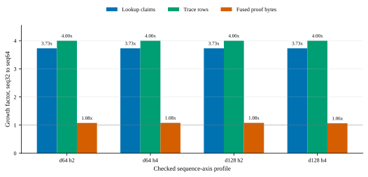

# Proof-Pressure Boundaries for STARK-Native Transformer Inference

**Omar Espejel**  
Starknet Foundation

**Abdelhamid Bakhta**  
StarkWare

*May 2026 draft*

## Abstract

Most zkML comparisons ask whether a proof system can swallow an entire model or
whether a single framework has a better headline proof size. This paper studies a
narrower proof-architecture question: where should the proof boundary be placed
inside transformer inference?

We evaluate STARK-native attention surfaces built over bounded integer
transformer fixtures. The core experiment compares one fused proof object for
attention arithmetic plus Softmax-table membership against a matched split
frontier consisting of a source arithmetic proof and a LogUp sidecar proof. On
four sequence-axis rows, moving from `seq32` to `seq64` grows lookup claims by
`3.729730x` and trace rows by `4.000000x`, while fused proof bytes grow only
`1.064910x` to `1.080697x`. The same fused objects remain smaller than their
matched split frontiers, with target fused ratios from `0.875605x` to
`0.922792x` on those rows. Local median-of-five timing on the measured `d64`
sequence rows grows near the work axis, so the result is proof-size
amortization rather than a proving-speed result.

The mechanism is visible in artifact accounting. In a ten-profile attention plus
LogUp section-delta slice, `92.7722%` of saved serialized proof bytes came from
the opening bucket, dominated by FRI proof and decommitment material. In an
attention-derived `d128` MLP-side typed-accounting slice, `90.5135%` of saved
typed bytes came from opening and decommitment plumbing. This supports a bounded
thesis: transformer proving should choose boundaries around actual proof
pressure. STARK-native fusion is useful where it shares commitment, opening, and
decommitment structure; width-heavy dense arithmetic may need different
boundaries or side protocols.

The paper also separates proof validity from statement validity. A proof can
verify while the application misstates the model, input, output, numeric policy,
verifier domain, or deployment event that the proof is allowed to mean. We
therefore treat typed statement envelopes, in the Tablero style, as a correctness
layer around proof artifacts rather than as a performance decoration.

The scope is deliberately limited to proof-boundary behavior on scoped
transformer surfaces. It is not presented as full LLM inference, an external
system benchmark, or a proof-family dominance claim.

---

## 1. Introduction

Transformer proving is often discussed with the wrong mental object. The model is
treated as one black box, and the proof system is judged by whether it can wrap
that box. That is not how the engineering pressure appears. Transformer
inference is structured: attention arithmetic, lookup-heavy nonlinear policies,
dense projections, residual surfaces, carried state, and verifier-facing
statement boundaries do not stress the prover in the same way.

If different regions create different proof pressure, a monolithic boundary is
not automatically the right research object. The useful question becomes:

> Which transformer work should share one proof object, and which work should be
> split or composed through a typed boundary?

This paper studies that question in a STARK-native setting. We introduce the
term **proof-pressure boundary** for a proof boundary selected by measured proof
cost rather than by source-code convenience or layer naming. A proof-pressure
boundary asks where the proof object pays for commitments, openings,
decommitments, queries, and statement plumbing, then chooses the boundary that
avoids paying the same expensive structure twice.

The main empirical result is intentionally narrow. In the attention
experiments, fusing bounded attention arithmetic with Softmax-table membership
keeps proof bytes almost flat under a sequence-axis stress that multiplies lookup
claims and trace rows. The measured sequence rows are not small toy deltas:
`seq32` to `seq64` multiplies lookup claims by `3.729730x` and trace rows by
`4.000000x`. Yet fused proof bytes grow only about eight percent, and in one row
about six and a half percent. The relevant shape is that work grows quickly,
proof bytes grow slowly, and the saving is attributable to shared proof
plumbing.

The result should not be oversold. The measured timing rows do not show fused
proving is faster. At `d64`, prove and verify timings grow near the work axis.
The d256 width-stress row still saves proof bytes against the split frontier, but
its fused proof ratio weakens to `0.964602x`, and measured timing is not a speed win.
That weakness is useful. It says the right paper is not "one big STARK proof wins
forever." The better claim is:

> Transformer zkML should choose proof boundaries around proof pressure. In the
> attention surfaces studied here, STARK-native fusion amortizes lookup-heavy
> sequence and head pressure in proof bytes, while width-heavy pressure points
> may require narrower or composed boundaries.

The paper makes four contributions.

1. **Boundary formulation.** We formulate proof-pressure boundaries as a
   practical method for placing transformer proof boundaries around duplicated
   proof-system plumbing.
2. **Sequence-axis evidence.** We report four sequence-axis rows
   in which lookup claims grow `3.729730x` and trace rows grow `4.000000x`, while
   fused proof bytes grow only `1.064910x` to `1.080697x`.
3. **Mechanism evidence.** We connect the proof-size result to opening and
   decommitment accounting, showing that saved bytes are dominated by shared
   opening material rather than by vague serialization effects.
4. **Statement-validity boundary.** We make explicit that proof verification is
   not application statement validity. Typed statement envelopes are necessary
   when proof artifacts become zkML application receipts.

All quantitative claims below are tied to artifact paths and reproduction
commands. Related systems are discussed by object class and source type:
locally reproduced, paper-reported, docs-reported, or unavailable.

---

## 2. Background: What a Boundary Pays For

A STARK proof object does not only pay for arithmetic constraints. It also pays
for commitments, query answers, FRI material, openings, decommitments, proof
configuration, proof-of-work, and wrapper metadata. Two proof objects can be
semantically adjacent while still paying two mostly separate proof-plumbing
costs.

That matters for transformer workloads because the same layer often contains
different cost regimes:

- dense linear algebra in projections and MLPs;
- lookup-heavy nonlinear policies such as bounded Softmax tables;
- range and normalization surfaces;
- carried state across decode steps;
- statement fields that bind model identity, input, output, verifier domain, and
  numeric policy.

The proof boundary should not be chosen only by the model's source-code
function names. It should be chosen by the proof object's cost structure. In the
attention experiments studied here, the split comparator is:

1. a source arithmetic proof for bounded attention arithmetic;
2. a LogUp sidecar proof for Softmax-table membership.

The fused route places both in one native proof object. The expected advantage
is not that attention arithmetic disappears. The expected advantage is that the
fused route can share commitment and opening structure that the split route pays
twice.

This is why proof-size evidence and timing evidence must be separated. A fused
proof can save bytes while still taking comparable or greater time to prove. In
this paper, proof-size amortization is the positive result. Proving speed is a
caveat.

---

## 3. Experimental Object

The experimental object is a family of native Stwo proof artifacts for bounded
integer attention fixtures. Each matched row records:

- source arithmetic proof bytes;
- LogUp sidecar proof bytes;
- source plus sidecar split frontier bytes;
- fused proof bytes;
- lookup-claim count;
- trace-row count;
- artifact validation and mutation rejection results.

The experiments are intentionally scoped. They do not claim exact real-valued
Softmax. They do not claim tokenization, imported model weights, accuracy,
perplexity, or full autoregressive decoding. They are proof-system experiments
over transformer-shaped attention surfaces.

The primary artifact records are:

- main evidence:
  `docs/engineering/evidence/zkai-proof-pressure-main-evidence-2026-05.tsv`;
- slope table:
  `docs/engineering/evidence/zkai-proof-pressure-slope-table-2026-05.tsv`;
- route matrix:
  `docs/engineering/evidence/zkai-attention-kv-fused-softmax-table-route-matrix-2026-05.tsv`;
- section delta:
  `docs/engineering/evidence/zkai-attention-kv-fused-softmax-table-section-delta-2026-05.tsv`;
- MLP-side fusion attribution:
  `docs/engineering/evidence/zkai-attention-derived-d128-mlp-fusion-attribution-2026-05.tsv`.

The main sequence-axis rows are:

| row | lookup growth | trace growth | fused proof growth | target fused bytes | split frontier bytes | saving | fused ratio |
|---|---:|---:|---:|---:|---:|---:|---:|
| `d64_h2_seq32_to_seq64` | `3.729730x` | `4.000000x` | `1.076519x` | `272,636` | `306,970` | `34,334` | `0.888152x` |
| `d64_h4_seq32_to_seq64` | `3.729730x` | `4.000000x` | `1.080558x` | `276,503` | `315,785` | `39,282` | `0.875605x` |
| `d128_h2_seq32_to_seq64` | `3.729730x` | `4.000000x` | `1.080697x` | `481,870` | `522,187` | `40,317` | `0.922792x` |
| `d128_h4_seq32_to_seq64` | `3.729730x` | `4.000000x` | `1.064910x` | `495,854` | `539,670` | `43,816` | `0.918810x` |

The `d64` sequence rows also have median-of-five release timing. Those
timings grow near the work axis, so they support the timing caveat rather than a
speed claim.

---

## 4. Main Result: Work Grows Faster Than Fused Proof Bytes

Figure 1 shows the central result. Across four sequence-axis rows, lookup claims
and trace rows grow by about four times from `seq32` to `seq64`, while fused
proof bytes grow only about `1.06x` to `1.08x`.



This is the proof-size signal. It does not say the prover did four times less
work. It says the emitted fused proof object did not grow in proportion to the
lookup and trace work represented by the artifact.

For the `d64` four-head row, the full sequence read is:

| profile | steps per head | lookup claims | trace rows | source proof bytes | sidecar proof bytes | split bytes | fused bytes | fused ratio |
|---|---:|---:|---:|---:|---:|---:|---:|---:|
| `d64_four_head_seq16` | `16` | `672` | `1,024` | `232,991` | `27,694` | `260,685` | `237,596` | `0.911430x` |
| `d64_four_head_seq32` | `32` | `2,368` | `4,096` | `254,145` | `34,147` | `288,292` | `255,889` | `0.887604x` |
| `d64_four_head_seq64` | `64` | `8,832` | `16,384` | `272,638` | `43,147` | `315,785` | `276,503` | `0.875605x` |

From `seq32` to `seq64`, lookup claims grow `3.729730x` and trace rows grow
`4.000000x`; the fused proof grows `1.080558x`; the saving grows `1.212295x`.
The larger row is not merely still positive. It improves the fused ratio against
the matched split frontier.

The same pattern appears in the other sequence-axis rows. The result is strongest
as a slope claim, not as a single proof-size anecdote.

---

## 5. Boundary Selection, Not Universal Fusion

The next question is whether larger fused boundaries are always better. The
reported grid suggests a more selective rule: fusion is most useful where it
eliminates duplicated proof plumbing, and less compelling where the boundary is
dominated by dense-width costs.

Figure 2 plots the fused proof bytes divided by the matched split frontier for
the slope rows. Values below `1.0` mean the fused boundary beats the
split comparator on proof bytes.


The head and sequence rows show the cleanest proof-size amortization. Width
growth is different. The `d128` to `d256` two-head `seq32` row still saves
`30,143` proof bytes, but the fused ratio weakens to `0.964602x`, and
median timing is not a speed win. The evidence does not support a universal
"fuse everything" rule. It supports a conditional rule:

> Fuse where the duplicated proof plumbing is the pressure; split or compose
> where the boundary starts paying dense-width costs that fusion does not
> amortize.

That is the useful architecture rule. It points naturally toward a hybrid
proving stack: STARK-native fusion for lookup-heavy attention boundaries,
typed composition between proof objects, and possibly GKR or sumcheck-style
side protocols for dense projection or MLP regions where they are a better fit.

---

## 6. Mechanism: Shared Opening Plumbing

The proof-size result could in principle be a serialization artifact. The
accounting evidence points instead to a proof-system explanation.

Figure 3 summarizes two independent attribution slices. The first is a ten-row
attention plus LogUp serialized section-delta analysis. The second is an
attention-derived `d128` MLP-side typed-accounting analysis.


In the attention plus LogUp section-delta slice:

- source arithmetic proofs total `591,286` bytes;
- LogUp sidecar proofs total `222,856` bytes;
- source plus sidecar total is `814,142` bytes;
- fused proofs total `629,466` bytes;
- fused saving is `184,676` bytes;
- opening bucket saving is `171,328` bytes, or `92.7722%` of the saving.

The opening bucket itself splits into `102,304` bytes of FRI proof saving and
`69,024` bytes of decommitment saving.

In the attention-derived `d128` MLP-side typed-accounting slice:

- six separate proof objects total `59,344` typed bytes;
- the fused proof is `22,576` typed bytes;
- typed saving is `36,768` bytes;
- FRI plus trace decommitments account for `33,280` bytes, or `90.5135%` of
  the saving.

These two slices study different surfaces and use different accounting regimes,
but they agree on the mechanism. The fused proof is smaller mostly because it
avoids carrying another opening surface. This is the STARK-native story in a
form that can be inspected from the artifacts.

The same evidence also blocks a tempting but wrong conclusion. The largest saved
bucket is verifier opening witness material. It cannot simply be deleted from a
valid proof object. The way to reduce duplicated opening material is to choose a
larger or better-aligned proof boundary, not to remove witness material that the
verifier needs.

---

## 7. Statement Validity: Why Proof Verification Is Not Enough

Proof-size amortization is only half of a zkML architecture story. The other half
is statement validity.

A raw proof verifier answers a narrow question: does this proof verify against
this verifier relation and public instance? A zkML application often claims
something wider:

- this model was used;
- this prompt or input was used;
- this output came from that input;
- this numeric policy was used;
- this lookup table or quantization policy was used;
- this proof belongs to this verifier domain;
- this receipt is allowed to trigger this deployment event.

Those are not automatically the same statement. A proof can verify and still be
misrepresented by the surrounding application. This is especially dangerous for
AI receipts because the receipt may be consumed by a policy engine, market, DAO,
agent, defense workflow, or compliance process that reads more meaning into the
artifact than the proof itself binds.

We use **Tablero** as the typed statement-boundary layer around proof artifacts.
In this context, Tablero is not the performance result. It is the correctness
envelope. It binds proof bytes to the statement they are allowed to mean:
verifier domain, source handles, model surface, input and output commitments,
numeric policy, table identity, replay dependencies, and scope metadata.

The connection to proof-pressure boundaries is direct. If we compose transformer
work through multiple proof objects, the composition boundary must preserve the
statement. If we fuse transformer work into one proof object, the fused boundary
still needs to say which model surface and application claim it certifies.
Proof-boundary optimization without statement-boundary discipline creates
valid-looking fragments.

---

## 8. Related Work and Comparison Discipline

Several recent systems approach verifiable ML from different proof boundaries.
NANOZK studies layerwise proof objects for LLM inference [1]. Jolt Atlas uses
lookup arguments for ONNX-style tensor operations [2]. zkLLM and zkAttn study
LLM and attention-specific proving paths [3]. DeepProve reports full-model LLM
inference proving [4]. EZKL, RISC Zero, SP1, and Stwo expose different
deployment and proof-system surfaces for verifiable computation [5-9].

These systems motivate, rather than settle, the boundary-selection question
studied here. Their public artifacts do not expose the same scoped object as the
fused attention plus Softmax-table boundary in this paper, so the paper does not
rank them by headline proof size. The comparison is architectural: many zkML
systems are already choosing specialized proof boundaries, and the evidence here
shows one STARK-native boundary where lookup-heavy attention work amortizes
proof bytes.

---

## 9. Limitations

The scope of the result is limited in several ways.

1. **Inference scope.** The artifacts are scoped transformer-shaped
   surfaces, not full autoregressive LLM inference.
2. **Transformer-block scope.** The paper does not claim a complete production
   block proof with imported weights, tokenizer behavior, residual policy, and
   standard model semantics.
3. **Softmax semantics.** The attention surfaces use bounded integer
   policies and Softmax-table membership.
4. **Timing.** The strongest positive result is proof-size amortization. Timing
   rows are included to distinguish size behavior from proving-speed behavior.
5. **Proof-family scope.** The result is evidence for a
   STARK-native boundary strategy, not a universal proof-family dominance claim.
6. **External benchmarks.** NANOZK, DeepProve, Jolt Atlas, zkLLM, EZKL,
   RISC Zero, and SP1 are discussed as related systems and future baselines, not
   as matched proof-size rows.
7. **Serialization.** Typed accounting is a project-level accounting stream,
   not a claim about a stable upstream Stwo proof binary format.
8. **Deployment.** No Starknet verifier, calldata accounting, or deployment
   hardening is claimed here.

These limitations narrow the contribution to a specific systems claim: the
reported artifacts expose a proof-size scaling pattern and a plausible mechanism
for it.

---

## 10. Artifact Availability and Reproduction

The figure source is `scripts/paper/generate_proof_pressure_boundaries_figures.py`.
It reads the checked TSV artifacts listed in Section 3 and writes the paper
figures plus TSV companions:

```bash
python3 scripts/paper/generate_proof_pressure_boundaries_figures.py
```

This command writes:

- `docs/paper/figures/proof-pressure-growth-factors-2026-05.svg`;
- `docs/paper/figures/proof-pressure-growth-factors-2026-05.png`;
- `docs/paper/figures/proof-pressure-growth-factors-2026-05.pdf`;
- `docs/paper/figures/proof-pressure-boundary-selection-2026-05.svg`;
- `docs/paper/figures/proof-pressure-boundary-selection-2026-05.png`;
- `docs/paper/figures/proof-pressure-boundary-selection-2026-05.pdf`;
- `docs/paper/figures/proof-pressure-opening-mechanism-2026-05.svg`;
- `docs/paper/figures/proof-pressure-opening-mechanism-2026-05.png`;
- `docs/paper/figures/proof-pressure-opening-mechanism-2026-05.pdf`.

The underlying evidence-generation commands are:

```bash
python3.10 scripts/zkai_proof_pressure_main_evidence_gate.py \
  --write-json docs/engineering/evidence/zkai-proof-pressure-main-evidence-2026-05.json \
  --write-tsv docs/engineering/evidence/zkai-proof-pressure-main-evidence-2026-05.tsv \
  --write-svg docs/engineering/evidence/zkai-proof-pressure-work-proof-growth-2026-05.svg
```

Slope-table evidence:

```bash
python3.10 scripts/zkai_proof_pressure_slope_table_gate.py \
  --write-json docs/engineering/evidence/zkai-proof-pressure-slope-table-2026-05.json \
  --write-tsv docs/engineering/evidence/zkai-proof-pressure-slope-table-2026-05.tsv \
  --write-md docs/engineering/zkai-proof-pressure-slope-table-2026-05-24.md
```

Section-delta evidence:

```bash
python3 scripts/zkai_attention_kv_fused_softmax_table_section_delta_gate.py \
  --write-json docs/engineering/evidence/zkai-attention-kv-fused-softmax-table-section-delta-2026-05.json \
  --write-tsv docs/engineering/evidence/zkai-attention-kv-fused-softmax-table-section-delta-2026-05.tsv
```

MLP-side attribution:

```bash
python3 scripts/zkai_attention_derived_d128_mlp_fusion_attribution_gate.py \
  --write-json docs/engineering/evidence/zkai-attention-derived-d128-mlp-fusion-attribution-2026-05.json \
  --write-tsv docs/engineering/evidence/zkai-attention-derived-d128-mlp-fusion-attribution-2026-05.tsv
```

---

## 11. Discussion

The result is strongest as a boundary-selection result, not as a final zkML
system benchmark. It shows that, on the reported attention surfaces, proof bytes
can grow much more slowly than lookup claims and trace rows when arithmetic and
table membership share one STARK-native proof object. It also shows that the
effect should not be generalized blindly: width pressure weakens the fused
ratio, and measured timing does not track the proof-size improvement.

This distinction matters for full transformer systems. A full block proof built
without boundary analysis may be larger than necessary or may place the
composition boundary in the wrong location. The reported evidence suggests a
more surgical path: fuse lookup-heavy attention surfaces where proof plumbing is
duplicated, compose through typed boundaries where separate proof objects are
preferable, and test dense regions with protocols specialized for dense
arithmetic when appropriate.

---

## 12. Future Work

The next step is to close the remaining comparison and block-surface gaps.

1. **External same-surface baseline.** Add one honest EZKL or zkVM baseline over
   a scoped transformer surface. The object must match enough to be meaningful.
2. **Block-boundary follow-up.** Move from fused attention plus table membership
   into a scoped attention plus RMSNorm plus MLP boundary, while preserving
   typed statement binding.
3. **Binary proof accounting.** Replace or supplement JSON and local typed bytes
   with stable binary or raw serialized accounting when the backend exposes a
   suitable surface.
4. **GKR or sumcheck side protocol.** Test dense projection and MLP regions with
   a side protocol rather than assuming one STARK-native monolith is best.
5. **Median timing policy.** Extend median-of-five timing to the `d128`
   sequence rows and any external baseline before making public performance
   claims.
6. **Statement-relabeling benchmark.** Turn the Tablero correctness layer into a
   clean benchmark across EZKL, snarkjs, RISC Zero-style receipts, JSTprove or
   Remainder, and Jolt Atlas if suitable public artifacts are available.

These directions keep the two linked themes together: proof-pressure boundaries
explain where transformer fusion helps, and typed statement boundaries explain
how proof artifacts become valid application claims.

---

## References

1. Zhaohui Geoffrey Wang. *NANOZK: Layerwise Zero-Knowledge Proofs for
   Verifiable Large Language Model Inference*. arXiv:2603.18046, 2026.
   <https://arxiv.org/abs/2603.18046>
2. Wyatt Benno, Alberto Centelles, Antoine Douchet, and Khalil Gibran.
   *Jolt Atlas: Verifiable Inference via Lookup Arguments in Zero Knowledge*.
   arXiv:2602.17452, 2026. <https://arxiv.org/abs/2602.17452>
3. Haochen Sun, Jason Li, and Hongyang Zhang. *zkLLM: Zero Knowledge Proofs for
   Large Language Models*. arXiv:2404.16109, 2024.
   <https://arxiv.org/abs/2404.16109>
4. Lagrange Labs. *DeepProve-1: The First zkML System to Prove a Full LLM
   Inference*. 2025. <https://lagrange.dev/blog/deepprove-1>
5. EZKL Docs. *Products*. <https://docs.ezkl.xyz/products/>
6. RISC Zero. *risc0 Source Repository*. <https://github.com/risc0/risc0>
7. Succinct Labs. *SP1 Source Repository*. <https://github.com/succinctlabs/sp1>
8. StarkWare. *S-two 2.0.0 is a Developer-Friendly, Fully Open-Source Toolkit*.
   Published 2026. <https://starkware.co/blog/s-two-2-0-0-prover-for-developers/>
9. StarkWare Labs. *stwo Source Repository*. <https://github.com/starkware-libs/stwo>
