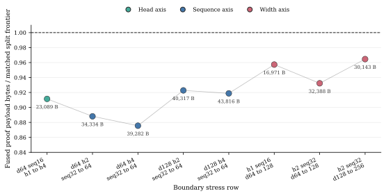
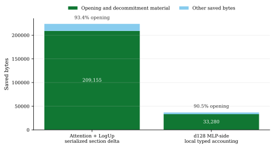
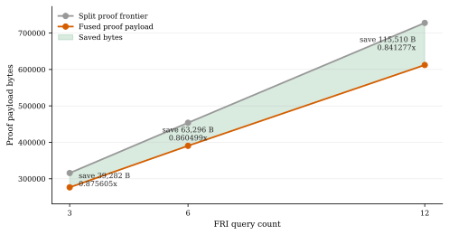

# Proof-Pressure Boundaries for STARK-Native Bounded Attention

**Omar Espejel**  
Starknet Foundation

**Abdelhamid Bakhta**  
StarkWare

*June 2026 draft*

## Abstract

We study how proof-boundary placement affects serialized proof payload size for
bounded integer attention fixtures over an unmodified Stwo backend. The split
design proves bounded attention arithmetic and bounded Softmax-table membership
as a source proof plus a LogUp sidecar proof. The fused design places both
relations in one STARK proof object.

Under a fixed experimental configuration, proof-of-work `10`, FRI log blowup
`1`, FRI query count `3`, and fold step `1`, four `seq32` to `seq64` rows show
lookup claims growing by about `3.73x` and trace rows by `4.0x`, while fused
proof payload bytes grow only about `1.06x` to `1.08x` and remain below matched
split payloads. Section-level accounting attributes `93.3903%` of the checked
attention-slice saving to opening-bucket material, mainly FRI proof and
decommitment bytes.

A higher-query sensitivity rerun on the `d64_four_head_seq64` surface preserves
the fused proof-size win when FRI query count is raised from `3` to `6` and
`12`: the fused saving grows from `39,282` bytes at `q=3` to `115,510` bytes at
`q=12`. This is engineering sensitivity evidence under an explicit
query-count-only patch, not a production-security parameter claim.

These measurements do not claim production security, exact real-valued Softmax,
full transformer inference, proving-speed improvement, a Stwo optimization, or
system-level superiority over zkML frameworks. They support a narrower design
rule: for STARK-native bounded attention, fuse proof regions when doing so
amortizes duplicated opening material, and preserve application meaning with
typed statement boundaries.

---

## 1. Introduction

Transformer proving is often discussed as if the model were a single black-box
object and the proof system were a wrapper around it. That abstraction hides the
different sources of proof pressure inside inference. Attention arithmetic,
lookup-heavy nonlinear policies, dense projections, residual surfaces, carried
state, and verifier-facing statement boundaries do not stress the prover in the
same way.

If different regions create different proof pressure, a monolithic boundary is
not automatically the right research object. The useful question becomes:

> Which transformer work should share one proof object, and which work should be
> split or composed through a typed boundary?

This paper studies that question in a STARK-native bounded-attention setting.
We introduce the term **proof-pressure boundary** for a proof boundary selected
by measured proof cost rather than by source-code convenience or layer naming.
A proof-pressure boundary asks where the proof object pays for commitments,
openings, decommitments, queries, and statement fields, then chooses the
boundary that avoids paying the same expensive structure twice.

We use **proof pressure** to mean the parts of a workload that
disproportionately contribute to proof material: commitments, openings,
decommitments, FRI material, lookup arguments, trace growth, and statement
plumbing. A proof-pressure boundary is a proof-object boundary chosen to share
or isolate this material deliberately. It is related to, but distinct from, the
typed statement boundary discussed in Section 7: one chooses where proof bytes
are paid, the other says what the resulting artifact is allowed to mean.

The evaluated surfaces are attention-shaped subcomputations. They do not
constitute a full transformer inference proof and do not include all model
components required for an end-to-end deployment claim, such as embeddings,
layer normalization, MLP blocks, activation policy, residual paths, KV-cache
policy, tokenizer and input canonicalization, exact output decoding, and
deployment binding.

The main empirical result is intentionally narrow. In the attention
experiments, fusing bounded attention arithmetic with Softmax-table membership
keeps serialized proof payload bytes almost flat under a sequence-axis stress
that multiplies lookup claims and trace rows. The measured sequence rows are not
small toy deltas: `seq32` to `seq64` multiplies lookup claims by about `3.73x`
and trace rows by `4.0x`. Yet fused proof payload bytes grow only about eight
percent, and in one row about six and a half percent. The split frontier also
grows slowly. The relevant shape is therefore not that only one route has
sublinear growth. It is: the STARK proof payload grows sublinearly on both
routes, and fusion keeps a lower frontier by avoiding duplicated opening and
decommitment material.

The measured timing rows do not show that fused proving is faster. At `d64`,
prove and verify timings grow near the work axis. The d256 width-stress row
still saves proof bytes against the split frontier, but its fused proof ratio
weakens to `0.964602x`, and measured timing is not a speed win. The evidence
therefore supports a boundary-selection claim rather than a universal
monolithic-fusion claim:

> Transformer zkML should choose proof boundaries around proof pressure. In the
> attention surfaces studied here, STARK-native fusion amortizes lookup-heavy
> sequence and head pressure in proof bytes, while width-heavy pressure points
> may require narrower or composed boundaries.

The paper makes five contributions.

1. **Boundary formulation.** We formulate proof-pressure boundaries as a
   practical method for placing transformer proof boundaries around duplicated
   proof-system plumbing.
2. **Sequence-axis evidence.** We report four sequence-axis rows
   in which lookup claims grow about `3.73x` and trace rows grow `4.0x`, while
   fused proof payload bytes grow only about `1.06x` to `1.08x`.
3. **Mechanism evidence.** We connect the proof-size result to opening and
   decommitment accounting, showing that saved bytes are dominated by shared
   opening material rather than by vague serialization effects.
4. **Query-count sensitivity.** We add a checked `d64_four_head_seq64`
   sensitivity slice showing that the fused proof-size advantage survives FRI
   query counts `6` and `12` under a query-count-only patch.
5. **Statement-validity boundary.** We make explicit that proof verification is
   not application statement validity. Typed statement envelopes are necessary
   when proof artifacts become zkML application receipts.

All quantitative claims below are tied to artifact paths and reproduction
commands. Related systems are discussed by object class and source type:
locally reproduced, paper-reported, docs-reported, or unavailable.

---

## 2. Background: What a Boundary Pays For

A STARK proof object does not only pay for arithmetic constraints. It also pays
for commitments, query answers, FRI material, openings, decommitments, proof
configuration, proof-of-work, and wrapper metadata. Two proof objects can be
semantically adjacent while still paying two mostly separate fixed per-proof
costs.

That matters for transformer workloads because the same layer often contains
different cost regimes:

- dense linear algebra in projections and MLPs;
- lookup-heavy nonlinear policies such as bounded Softmax tables;
- range and normalization surfaces;
- carried state across decode steps;
- statement fields that bind model identity, input, output, verifier domain, and
  numeric policy.

The proof boundary should not be chosen only by the model's source-code
function names. It should be chosen by the proof object's cost structure. In the
attention experiments studied here, the split comparator is:

1. a source arithmetic proof for bounded attention arithmetic;
2. a LogUp sidecar proof for Softmax-table membership.

The fused route places both in one native proof object. The expected advantage
is not that attention arithmetic disappears. The expected advantage is that the
fused route can share commitment and opening structure that the split route pays
twice.

This is why proof-size evidence and timing evidence must be separated. A fused
proof can save bytes while still taking comparable or greater time to prove. In
this paper, proof-size amortization is the positive result. Proving speed is a
caveat.

The pressure columns in this paper are proxies, not a complete prover-cost
model. `lookup claims` count table-membership checks that the LogUp sidecar or
fused boundary has to represent. `trace rows` count AIR execution rows in the
native attention surface. They are useful because they expose the scaling axis
being stressed, but they do not replace committed-column counts, backend
opening geometry, host memory, or timing measurements.

---

## 3. Experimental Object

The experimental object is a family of native Stwo proof artifacts for bounded
integer attention fixtures. Stwo is used here as an open Circle STARK
implementation vehicle. The experiments do not patch Stwo's prover, verifier,
FRI protocol, hash channels, or security configuration; they change the
transformer proof boundary and the statement-bound artifact construction built
on top of that backend. Each matched row records:

- source arithmetic proof payload bytes;
- LogUp sidecar proof payload bytes;
- source plus sidecar split frontier payload bytes;
- fused proof payload bytes;
- lookup-claim count;
- trace-row count;
- artifact validation and mutation rejection results.

The experiments are intentionally scoped. They do not claim exact real-valued
Softmax. They do not claim tokenization, imported model weights, accuracy,
perplexity, or full autoregressive decoding. They are proof-system experiments
over transformer-shaped attention surfaces.

The experimental object and comparator are:

| item | exact scope in this paper |
|---|---|
| Workload | bounded integer causal-attention fixture |
| Numeric policy | clipped score-gap bounded Softmax table with integer floor-division outputs |
| Fused relation | bounded attention arithmetic plus bounded Softmax-table membership |
| Split comparator | source arithmetic proof plus LogUp table-membership sidecar proof |
| Counted bytes | serialized Stwo proof payload stored in each envelope's `proof` byte array |
| Excluded bytes | full envelope JSON, source input JSON, generated fixture data, and project-local typed-accounting stream |
| Fixed config | proof-of-work `10`, FRI log blowup `1`, FRI query count `3`, FRI fold step `1` |
| Security interpretation | fixed experimental configuration, not a production-security recommendation |
| Timing interpretation | proof-byte result only; no proving-speed or verifier-speed claim |
| Full inference? | no |
| Exact real-valued Softmax? | no |

The byte accounting used for the main table is deliberately narrow. The
headline `proof bytes` are the length of the serialized Stwo proof payload stored
in each envelope's `proof` byte array, after decoding the payload as a
`{"stark_proof": ...}` object. They exclude the larger statement envelope JSON,
source input JSON, and generated fixture data. They also exclude the separate
project-local `typed bytes` accounting stream used in some engineering gates.
Those typed bytes are useful for internal comparison, but they are not presented
as the same object as the serialized Stwo proof payload.

The split frontier is computed as source proof payload bytes plus sidecar proof
payload bytes. The sidecar is an actual generated LogUp proof artifact in the
checked rows, not an estimate. The route-matrix evidence uses the same fixed
experimental configuration across the checked fused and split rows; the only
intended experimental variable is boundary placement. The raw checked envelopes
for the tracked rows parse to the following configuration on source, sidecar,
and fused routes:

This split frontier is not claimed to be the best possible composed proof
system. It is the matched source-plus-LogUp-sidecar object produced by this
repository under the same backend configuration. It does not include recursive
aggregation, a shared Fiat-Shamir channel across two separate proof objects, or
a future shared-channel split design. Those are important follow-up baselines.
The comparison here asks a narrower question: against the actual independent
source-plus-sidecar frontier used by the artifact, does a fused native boundary
avoid duplicated proof material while preserving the checked statement surface?

| parameter | value |
|---|---:|
| proof of work bits | `10` |
| FRI log blowup factor | `1` |
| FRI last-layer degree-bound log | `0` |
| FRI query count | `3` |
| FRI fold step | `1` |
| PCS lifting log size | `None` |

This is important for interpretation. A proof-size saving under the same backend
configuration is evidence about boundary placement and shared STARK plumbing,
not evidence that a private prover fork made the byte count smaller. The
measurements use this fixed experimental Stwo configuration to isolate
boundary-placement effects. They are not presented as a production-security
parameter recommendation. Stwo's public documentation describes a `StarkProof`
as containing commitments, openings, and FRI proof material [10], and its
polynomial commitment scheme requires Merkle decommitments for verifier queries
[11]. The mechanism measured below is therefore exactly the kind of mechanism a
STARK proof object pays for: commit, open, decommit, and carry FRI witness
material.

The checked repository build pins the implementation crates `stwo = "2.2.0"`
and `stwo-constraint-framework = "2.2.0"` in `Cargo.toml`. Public S-two
documentation is cited for proof-object structure, not as a substitute for the
exact crate-version statement.

One implementation naming note matters for audit. The measured bounded-attention
PCS profile is intentionally separate from the older Vanilla STARK publication
profile:

| profile name | code path | parameters | status in this paper |
|---|---|---|---|
| fixed Stwo measurement profile | bounded-attention Stwo evidence | PoW `10`, log blowup `1`, q `3`, fold `1` | main proof-byte measurement profile; no production-security claim |
| d64 query-sensitivity profile | bounded-attention Stwo evidence with explicit q patch | PoW `10`, log blowup `1`, q in `{6, 12}`, fold `1` | engineering sensitivity only; not production security |
| Vanilla publication-v1 helper | `src/proof.rs` VM profile helper | expansion `16`, colinearity checks `24`, conjectured floor `96` bits | not used for the paper's Stwo PCS proof-byte rows |

By the repository's simple query-blowup floor formula, the measured q3, q6, and
q12 Stwo PCS rows correspond to `3`, `6`, and `12` query-blowup bits before
proof-of-work. This is not a formal Stwo soundness calculation; it is an audit
label that makes the scope impossible to confuse with the Vanilla
`publication_v1_stark_options()` path. In this paper, `q=3` means the fixed
experimental Stwo PCS measurement profile in the table above, not a
production-security profile. The cited bounded-attention proof surfaces call
`fixed_stwo_measurement_pcs_config()` directly; the legacy
`publication_v1_pcs_config()` alias remains only for older non-paper generated
modules.

The large `d128_h4_seq64` row is represented by checked gate and route-matrix
evidence with proof commitments, exact byte counts, mutation rejection, and
regeneration commands. Its source input plus source, sidecar, and fused
envelopes are about `118` to `141` MB each, above GitHub's `100` MB blob limit,
so they are not tracked in the checkout. They are pinned by the digest manifest
`docs/engineering/evidence/zkai-attention-kv-stwo-native-d128-four-head-seq64-large-artifacts-2026-05.json`,
which records artifact sizes, `sha256` digests, per-artifact
`regenerate_command` entries, the `blake2b-256` source-statement commitment,
and native `verify` commands. Treat that row as a proof-size artifact row, not
as a timing or external-comparison row.

The primary artifact records are:

- main evidence:
  `docs/engineering/evidence/zkai-proof-pressure-main-evidence-2026-05.tsv`;
- slope table:
  `docs/engineering/evidence/zkai-proof-pressure-slope-table-2026-05.tsv`;
- route matrix:
  `docs/engineering/evidence/zkai-attention-kv-fused-softmax-table-route-matrix-2026-05.tsv`;
- section delta:
  `docs/engineering/evidence/zkai-attention-kv-fused-softmax-table-section-delta-2026-05.tsv`;
- MLP-side fusion attribution:
  `docs/engineering/evidence/zkai-attention-derived-d128-mlp-fusion-attribution-2026-05.tsv`.

The main sequence-axis rows are:

| row | lookup growth | trace growth | fused proof growth | split proof growth | target fused bytes | split frontier bytes | saving | fused ratio |
|---|---:|---:|---:|---:|---:|---:|---:|---:|
| `d64_h2_seq32_to_seq64` | `3.729730x` | `4.000000x` | `1.076519x` | `1.076702x` | `272,636` | `306,970` | `34,334` | `0.888152x` |
| `d64_h4_seq32_to_seq64` | `3.729730x` | `4.000000x` | `1.080558x` | `1.095365x` | `276,503` | `315,785` | `39,282` | `0.875605x` |
| `d128_h2_seq32_to_seq64` | `3.729730x` | `4.000000x` | `1.080697x` | `1.091811x` | `481,870` | `522,187` | `40,317` | `0.922792x` |
| `d128_h4_seq32_to_seq64` | `3.729730x` | `4.000000x` | `1.064910x` | `1.068793x` | `495,854` | `539,670` | `43,816` | `0.918810x` |

The `d64` sequence rows also have median-of-five release timing. Those
timings grow near the work axis, so they support the timing caveat rather than a
speed claim.

---

## 4. Main Result: Work Grows Faster Than Fused Proof Bytes

Figure 1 shows the central result. Across four sequence-axis rows, lookup claims
and trace rows grow by about four times from `seq32` to `seq64`, while both the
split frontier and fused proof payload grow much more slowly. The positive
result is not that only fusion has sublinear proof-size growth. The positive
result is that the fused route remains the lower matched proof-byte frontier.


This is the proof-size signal. It does not say the prover did four times less
work. It also does not say the split proof frontier grows linearly with trace
rows; it does not. It says the emitted fused proof object did not grow in
proportion to the lookup and trace work represented by the artifact, and that it
remained below the matched split frontier at each measured endpoint.

All proof-byte rows in this section use the fixed experimental Stwo
configuration in Section 3. These are boundary-placement measurements, not
production-security parameters.

For the `d64` four-head row, the full sequence read is:

| profile | steps per head | lookup claims | trace rows | source proof bytes | sidecar proof bytes | split bytes | fused bytes | fused ratio |
|---|---:|---:|---:|---:|---:|---:|---:|---:|
| `d64_four_head_seq16` | `16` | `672` | `1,024` | `232,991` | `27,694` | `260,685` | `237,596` | `0.911430x` |
| `d64_four_head_seq32` | `32` | `2,368` | `4,096` | `254,145` | `34,147` | `288,292` | `255,889` | `0.887604x` |
| `d64_four_head_seq64` | `64` | `8,832` | `16,384` | `272,638` | `43,147` | `315,785` | `276,503` | `0.875605x` |

From `seq32` to `seq64`, lookup claims grow `3.729730x` and trace rows grow
`4.000000x`; the fused proof grows `1.080558x`; the saving grows `1.212295x`.
The larger row is not merely still positive. It improves the fused ratio against
the matched split frontier.

The same pattern appears in the other sequence-axis rows. The result is strongest
as a slope claim plus a frontier claim: sublinear proof payload growth under the
sequence stress, with the fused route staying smaller than the matched split
route.

---

## 5. Boundary Selection, Not Universal Fusion

The next question is whether larger fused boundaries are always better. The
reported grid suggests a more selective rule: fusion is most useful where it
eliminates duplicated proof plumbing, and less compelling where the boundary is
dominated by dense-width costs.

Figure 2 plots the fused proof payload bytes divided by the matched split frontier for
the slope rows. Values below `1.0` mean the fused boundary is smaller than the
split comparator on proof bytes.



The head and sequence rows show the cleanest proof-size amortization. Width
growth is different. The `d128` to `d256` two-head `seq32` row still saves
`30,143` proof bytes, but the fused ratio weakens to `0.964602x`, and
median timing is not a speed win. The evidence does not support a universal
"fuse everything" rule. It supports a conditional rule:

> Fuse where the duplicated proof plumbing is the pressure; split or compose
> where the boundary starts paying dense-width costs that fusion does not
> amortize.

That is the useful architecture rule. It points naturally toward a hybrid
proving stack: STARK-native fusion for lookup-heavy attention boundaries,
typed composition between proof objects, and possibly GKR or sumcheck-style
side protocols for dense projection or MLP regions where they are a better fit.

---

## 6. Mechanism: Shared Opening Plumbing

The proof-size result could in principle be only a serialization artifact. The
accounting evidence points instead to a proof-system explanation, with an
important scope limit: the analysis is over serialized proof sections and typed
engineering accounting, not over a backend-internal binary PCS trace.

Figure 3 summarizes two independent attribution streams. The first is an
eleven-row attention plus LogUp serialized section-delta analysis, including the
`d64_four_head_seq64` decision-gate row. The second is an attention-derived
`d128` MLP-side typed-accounting analysis.



In the attention plus LogUp serialized proof-section slice:

- source arithmetic proofs total `863,924` bytes;
- LogUp sidecar proofs total `266,003` bytes;
- source plus sidecar total is `1,129,927` bytes;
- fused proofs total `905,969` bytes;
- fused saving is `223,958` bytes;
- opening bucket saving is `209,155` bytes, or `93.3903%` of the saving.

The opening bucket itself splits into `129,316` bytes of FRI proof saving and
`79,839` bytes of decommitment saving. The included `d64_four_head_seq64` row
alone saves `39,282` proof payload bytes; `37,827` of those bytes are in the
opening bucket, split between `27,012` bytes of FRI proof saving and `10,815`
bytes of decommitment saving.

| attention section-delta category | bytes saved | share of total saving |
|---|---:|---:|
| FRI proof material | `129,316` | `57.7412%` |
| Decommitment material | `79,839` | `35.6491%` |
| Other proof material | `14,803` | `6.6097%` |
| Total | `223,958` | `100.0000%` |

In the attention-derived `d128` MLP-side typed-accounting slice:

- six separate proof objects total `59,344` typed bytes;
- the fused proof is `22,576` typed bytes;
- typed saving is `36,768` bytes;
- FRI plus trace decommitments account for `33,280` bytes, or `90.5135%` of
  the saving.

These two attribution streams study different surfaces and use different
accounting regimes, but they agree on the mechanism. The fused proof is smaller
mostly because it avoids carrying another opening surface. This is the
STARK-native story in a form that can be inspected from the artifacts. It is not
a claim that the serialized proof labels every byte as "attention arithmetic" or
"lookup"; the checked section-delta gate explicitly records that such a
backend-internal split is unavailable from the serialized proof object.

The same evidence also blocks a tempting but wrong conclusion. The largest saved
bucket is verifier opening witness material. It cannot simply be deleted from a
valid proof object. The way to reduce duplicated opening material is to choose a
larger or better-aligned proof boundary, not to remove witness material that the
verifier needs.

This is also where a future Stwo-AI agenda becomes concrete. If the savings are
dominated by opening and decommitment geometry, then a useful backend
specialization would not be "make a prover for AI" in the abstract. It would
target specific STARK plumbing: how transformer-shaped columns are grouped,
which lookup tables share identity, how heterogeneous domains are lifted, how
openings are batched, and how higher-soundness query settings change the fused
versus split ratio. The current paper does not require those changes; it shows
where they would matter.

A simple cost model explains the observed boundary rule:

```text
proof payload bytes ~= fixed per-proof material
                    + FRI material
                    + decommitment material
                    + relation-specific payload
                    + wrapper/accounting material
```

In the matched split route, the source proof and sidecar proof each carry their
own fixed per-proof material, FRI material, and decommitment surface. In the
fused route, the attention arithmetic and table-membership relation share one
proof object, so the duplicated opening surface is partly collapsed. This model
predicts the measured sequence and head-axis behavior: when lookup-heavy work
increases but the opening surface can still be shared, proof payload bytes grow
much more slowly than lookup claims and trace rows. It also predicts the width
caveat: when dense relation-specific payload grows, fusion can still save bytes
against split proofs, but the fused-to-split ratio weakens because less of the
new work is duplicated opening material.

The model makes the query-count check useful. If the fused boundary is really
saving shared opening and decommitment plumbing, then increasing only the FRI
query count should raise absolute savings on the same semantic workload. That is
what the d64 higher-query slice tests. It is still an engineering sensitivity
slice, not a production-security sweep, because proof-of-work, blowup, fold
step, and verifier resource caps are held fixed.

This model is descriptive for the checked artifacts, not a general STARK lower
bound. A higher-query sensitivity slice supports the mechanism without turning
it into a production-security claim. On the `d64_four_head_seq64` surface,
raising FRI query count from `3` to `6` and `12` preserved the fused proof-size
win:

| FRI queries | split proof bytes | fused proof bytes | saving | fused ratio |
|---:|---:|---:|---:|---:|
| `3` | `315,785` | `276,503` | `39,282` | `0.875605x` |
| `6` | `453,733` | `390,437` | `63,296` | `0.860499x` |
| `12` | `727,747` | `612,237` | `115,510` | `0.841277x` |

The section-level accounting for the same q3/q6/q12 row gives the mechanism
check. Opening-bucket saving here means FRI proof material plus decommitment
material. Query-value saving means sampled and queried value bytes. The
remaining column is the small residual from other serialized proof sections, so
each row reconciles exactly to the total saving.

| FRI queries | total saving | opening-bucket saving | opening-bucket share | query-value saving | remaining saving |
|---:|---:|---:|---:|---:|---:|
| `3` | `39,282` | `37,827` | `96.3%` | `850` | `605` |
| `6` | `63,296` | `61,665` | `97.4%` | `1,026` | `605` |
| `12` | `115,510` | `113,219` | `98.0%` | `1,685` | `606` |

The q3-to-q12 marginal slope makes the mechanism sharper:

| q3 to q12 quantity | marginal bytes per extra FRI query |
|---|---:|
| split proof frontier | about `45,774` |
| fused proof payload | about `37,304` |
| total saving | about `8,470` |
| opening-bucket saving | about `8,377` |
| query-value saving | about `93` |
| remaining saving | about `0` |

Almost all of the marginal saving per extra query comes from the opening bucket.
That is the quantitative version of the mechanism claim: the fused boundary
shares proof plumbing; it does not remove the relation-specific queried values.

This is why the higher-query slice matters: as the query count rises on the same
semantic workload, the extra fused saving is still overwhelmingly in shared
opening material rather than in the relation-specific values themselves.

Figure 4 plots the same row. The main checked measurement profile remains the
fixed `q=3` Stwo PCS configuration. The q6 and q12 rows are engineering reruns
under an explicit FRI-query-count patch with proof-of-work, blowup, and fold
step held fixed. They show that the fused advantage survives a larger query
count on a real d64 headline surface; they do not recommend production
parameters or claim that the same pattern has been measured on d128.



---

## 7. Statement Validity: Why Proof Verification Is Not Enough

Proof-size amortization is only half of a zkML architecture story. The other half
is statement validity.

A raw proof verifier answers a narrow question: does this proof verify against
this verifier relation and public instance? A zkML application often claims
something wider:

- this model was used;
- this prompt or input was used;
- this output came from that input;
- this numeric policy was used;
- this lookup table or quantization policy was used;
- this proof belongs to this verifier domain;
- this receipt is allowed to trigger this deployment event.

Those are not automatically the same statement. A proof can verify and still be
misrepresented by the surrounding application. This is especially dangerous for
AI receipts because the receipt may be consumed by a policy engine, market, DAO,
agent, defense workflow, or compliance process that reads more meaning into the
artifact than the proof itself binds.

The proof-size measurements in this paper concern boundary placement and proof
material. They do not by themselves establish an application-level inference
statement. An application-level statement is hard-bound only to the extent that
the verifier public inputs bind the model identity, input identity, output
identity, numeric policy, verifier domain, and deployment claim. Metadata outside
those public inputs is advisory envelope metadata, not part of the
cryptographically verified statement.

For the checked artifacts in this paper, the current binding surface is:

| field | hard-bound verifier input in current artifact? | current binding method | advisory if not hard-bound? |
|---|---:|---|---:|
| Model identity | no, not for a full model checkpoint | scoped model-surface identifiers and source handles in the typed envelope | yes |
| Input identity | yes, for scoped fixture commitments | public-instance and statement commitments for the checked source surface | no for scoped fixture; yes for full prompt provenance |
| Output identity | yes, for scoped output commitments | public-instance and statement commitments for the checked output surface | no for scoped output; yes for decoded-token claims |
| Numeric policy | yes, for the implemented bounded integer policy | table identity, range policy, and numeric-policy fields in the checked statement surface | yes for broader deployment semantics |
| Verifier domain | yes, for the checked proof domain | verifier-domain and proof-backend identifiers in the typed statement surface | no for the scoped proof domain |
| Deployment claim | no | no production deployment event is hard-bound | yes |

Fields marked advisory should not be described as part of the verified
application statement. They are useful envelope metadata for audit and replay,
but they are not the same as verifier public input.

We use **Tablero** as the typed statement-boundary layer around proof artifacts.
In this context, Tablero is not the performance result. It is the correctness
envelope. It separates hard-bound verifier inputs from advisory envelope
metadata, so downstream software can tell what the proof is allowed to mean:
verifier domain, source handles, model surface, input and output commitments,
numeric policy, table identity, replay dependencies, and scope metadata.

The connection to proof-pressure boundaries is direct. If we compose transformer
work through multiple proof objects, the composition boundary must preserve the
statement. If we fuse transformer work into one proof object, the fused boundary
still needs to say which model surface and application claim it certifies.
Proof-boundary optimization without statement-boundary discipline creates
valid-looking fragments. Appendix
[Statement Validity for zkML Proof Artifacts](appendix-zkml-statement-validity-2026.md)
states this boundary discipline in a self-contained form.

---

## 8. Related Work and Comparison Discipline

Several recent systems approach verifiable ML from different proof boundaries.
NANOZK studies layerwise proof objects for LLM inference [1]. Jolt Atlas uses
lookup arguments for ONNX-style tensor operations [2]. zkLLM and zkAttn study
LLM and attention-specific proving paths [3]. DeepProve reports GPT-2-scale
full-model LLM inference proving and, in its June 2026 public release, exposes
source and benchmark-facing documentation [4]. EZKL, RISC Zero, SP1, and Stwo expose
different deployment and proof-system surfaces for verifiable computation
[5-11].

These systems motivate, rather than settle, the boundary-selection question
studied here. Their public artifacts do not expose the same scoped object as the
fused attention plus Softmax-table boundary in this paper, so the paper does not
rank them by headline proof size. We do not present a system-level comparison
against NANOZK, Jolt Atlas, DeepProve, zkLLM, EZKL, RISC Zero, SP1, or other
zkML systems. The contribution is an intra-backend boundary-placement study. In
this draft, NANOZK, Jolt Atlas, and zkLLM/zkAttn are treated as paper-reported
related work; DeepProve is treated as docs-reported related work; and EZKL,
RISC Zero, SP1, and Stwo are treated as docs or source-reported infrastructure
references. The comparison is architectural: many zkML systems are already
choosing specialized proof boundaries, and the evidence here shows one
STARK-native boundary where lookup-heavy attention work amortizes proof bytes.

| system | public object | boundary style | same surface? | used as baseline? |
|---|---|---|---:|---:|
| NANOZK | layerwise LLM proof paper | layer proof boundary | no | no |
| Jolt Atlas | ONNX/lookup zkML paper | lookup-heavy tensor operations | no | no |
| zkLLM/zkAttn | LLM and attention proving papers | attention-specialized proving | no | no |
| DeepProve | public source and docs | GPT-2-scale full-model proving stack | no | no |
| EZKL | public infrastructure | ONNX-oriented proving stack | no | future |
| RISC Zero/SP1 | public infrastructure | zkVM receipts | no | future |
| Stwo | backend used here | Circle STARK backend | yes, as backend | not external |

The Stwo comparison is different from the NANOZK or Jolt Atlas comparison
because Stwo is the backend used by the artifacts, not an external zkML system
being beaten. Stwo's public repository describes it as a production Circle STARK
prover and verifier with modular core proof-system, constraint-framework, AIR,
and lookup components [9]. That modularity is why this paper can study a
transformer boundary on top of Stwo without claiming to optimize Stwo itself.
It is also why a future Stwo-AI line should be framed as backend specialization
for transformer-shaped STARK workloads, not as a premise of the current result.

---

## 9. Limitations

The scope of the result is limited in several ways.

1. **Inference scope.** The artifacts are scoped transformer-shaped
   surfaces, not full autoregressive LLM inference. They do not include
   embeddings, full layer normalization, full MLP blocks, activation policy for
   a deployed model, residual-path integration, KV-cache policy, tokenizer or
   prompt canonicalization, exact output decoding, or deployment binding.
2. **Transformer-block scope.** The paper does not claim a complete production
   block proof with imported weights, tokenizer behavior, residual policy, and
   standard model semantics.
3. **Softmax semantics.** The measurements concern the proof boundaries around
   scoped attention surfaces under the implemented numeric policy. They do not
   establish exact real-valued Softmax semantics.
4. **Timing.** We report proof-byte behavior. We do not claim a proving-time,
   memory-use, verifier-time, or hardware-efficiency breakthrough. Timing rows
   are included to distinguish size behavior from proving-speed behavior.
5. **Proof-family scope.** The result is evidence for a
   STARK-native boundary strategy, not a universal proof-family dominance claim.
6. **External benchmarks.** NANOZK, DeepProve, Jolt Atlas, zkLLM, EZKL,
   RISC Zero, and SP1 are discussed as related systems and future baselines, not
   as matched proof-size rows.
7. **Serialization.** The headline proof-size rows count serialized Stwo
   proof-payload bytes inside the proof envelope. Typed accounting is a
   separate project-level stream, and neither stream is claimed to be a stable
   upstream Stwo binary wire format.
8. **Deployment.** No Starknet verifier, calldata accounting, or deployment
   hardening is claimed here.
9. **Proof configuration.** The checked rows use a fixed low-query engineering
   Stwo configuration: proof-of-work `10` bits, FRI log blowup `1` (blowup
   factor `2`), FRI query count `3`, and FRI fold step `1`. The reported proof
   bytes and fused-to-split ratios are measurements under that fixed
   experimental configuration, not production-security constants. Changing the
   query count, blowup factor, or proof-of-work setting can move both absolute
   proof bytes and fused-to-split ratios. A d64 four-head seq64 sensitivity
   slice at FRI query counts `6` and `12` is included as engineering evidence,
   but it is not a production-security profile, not a timing claim, and not a
   d128 high-query result. Width-axis high-query sensitivity remains future work
   for a separate artifact package.
10. **Backend optimization scope.** The paper does not claim a Stwo-AI fork,
    upstream Stwo patch, SIMD change, verifier rewrite, or new PCS. The checked
    savings come from proof-boundary construction over the existing backend
    surface. Backend specialization is future work.

These limitations narrow the contribution to a specific systems claim: the
reported artifacts expose a proof-size scaling pattern and a plausible mechanism
for it.

---

## 10. Artifact Availability and Reproduction

Use a Python environment with the paper dependencies installed from
`scripts/requirements.txt` before running the figure scripts. The paper package
pins matplotlib and numpy for local figure preview consistency, but rendered
PDF, PNG, and SVG bytes can still depend on system freetype, libpng, and fonts.
The release gate therefore byte-diffs deterministic TSV companions, JSON, and
Markdown artifacts. Rendered figures are regenerated preview artifacts, not the
portable byte-exact reproducibility boundary. The evidence gates below use
`python3.10`.

The release audit packet is
`docs/paper/PAPER_RELEASE_AUDIT_PACKET_2026_06_04.md`. The machine-readable
release manifest is
`docs/paper/evidence/stark-native-transformer-paper-release-manifest-2026-06.json`.
It records the correct repository namespace, artifact SHA-256 digests, the fixed
experimental Stwo configuration, and the launch-gate command list. For public
launch, run the commands below on the final merged release commit and record that
regeneration produced no diff against the committed paper artifacts.

The release gate is a paper-artifact no-drift gate. It regenerates claim packs,
summaries, deterministic figure TSVs, and release packets from committed or
digest-pinned evidence, then fails if the checked paper package drifts. It is
not the default heavy proof-regeneration path for every large proof envelope.
Large envelopes are pinned by digest manifests and carry separate regenerate and
native-verify commands.

The figure source is `scripts/paper/generate_proof_pressure_boundaries_figures.py`.
It reads the checked TSV artifacts listed in Section 3 and writes the paper
figures plus TSV companions:

```bash
python3 scripts/paper/generate_proof_pressure_boundaries_figures.py
```

This command writes:

- `docs/paper/figures/proof-pressure-growth-factors-2026-05.svg`;
- `docs/paper/figures/proof-pressure-growth-factors-2026-05.png`;
- `docs/paper/figures/proof-pressure-growth-factors-2026-05.pdf`;
- `docs/paper/figures/proof-pressure-growth-factors-2026-05.tsv`;
- `docs/paper/figures/proof-pressure-boundary-selection-2026-05.svg`;
- `docs/paper/figures/proof-pressure-boundary-selection-2026-05.png`;
- `docs/paper/figures/proof-pressure-boundary-selection-2026-05.pdf`;
- `docs/paper/figures/proof-pressure-boundary-selection-2026-05.tsv`;
- `docs/paper/figures/proof-pressure-opening-mechanism-2026-05.svg`;
- `docs/paper/figures/proof-pressure-opening-mechanism-2026-05.png`;
- `docs/paper/figures/proof-pressure-opening-mechanism-2026-05.pdf`;
- `docs/paper/figures/proof-pressure-opening-mechanism-2026-05.tsv`.

The evidence rows use the native Stwo bounded-integer Softmax-table fixture
family. The route-matrix claim boundary is engineering proof-byte accounting for
matched source-plus-sidecar and fused bounded Softmax-table artifacts. It
explicitly excludes real-valued Softmax, full inference, timing claims,
recursion or PCD, and public benchmark claims.
The main timing mode is
`median_of_5_in_process_release_timing_for_d64_and_d256_engineering_only`.
The four paper sequence rows are `seq32` to `seq64` transitions with `32` and
`64` steps per head; the `d64` rows have local median-of-five release timing,
while the `d128` sequence rows are proof-size only in this artifact.

The underlying evidence-generation commands are:

```bash
python3.10 scripts/zkai_proof_pressure_main_evidence_gate.py \
  --write-json docs/engineering/evidence/zkai-proof-pressure-main-evidence-2026-05.json \
  --write-tsv docs/engineering/evidence/zkai-proof-pressure-main-evidence-2026-05.tsv \
  --write-svg docs/engineering/evidence/zkai-proof-pressure-work-proof-growth-2026-05.svg
```

Slope-table evidence:

```bash
python3.10 scripts/zkai_proof_pressure_slope_table_gate.py \
  --write-json docs/engineering/evidence/zkai-proof-pressure-slope-table-2026-05.json \
  --write-tsv docs/engineering/evidence/zkai-proof-pressure-slope-table-2026-05.tsv \
  --write-md docs/engineering/zkai-proof-pressure-slope-table-2026-05-24.md
```

Section-delta evidence:

```bash
python3.10 scripts/zkai_attention_kv_fused_softmax_table_section_delta_gate.py \
  --write-json docs/engineering/evidence/zkai-attention-kv-fused-softmax-table-section-delta-2026-05.json \
  --write-tsv docs/engineering/evidence/zkai-attention-kv-fused-softmax-table-section-delta-2026-05.tsv
```

MLP-side attribution:

```bash
python3.10 scripts/zkai_attention_derived_d128_mlp_fusion_attribution_gate.py \
  --write-json docs/engineering/evidence/zkai-attention-derived-d128-mlp-fusion-attribution-2026-05.json \
  --write-tsv docs/engineering/evidence/zkai-attention-derived-d128-mlp-fusion-attribution-2026-05.tsv
```

Paper claim-pack and no-drift release checks:

```bash
python3.10 scripts/zkai_paper_claim_pack_gate.py \
  --write-json docs/paper/evidence/stark-native-transformer-claim-pack-2026-05.json

python3.10 -m py_compile \
  scripts/zkai_paper_claim_pack_gate.py \
  scripts/zkai_attention_kv_high_query_sensitivity_gate.py \
  scripts/zkai_attention_kv_d64_high_query_sensitivity_gate.py \
  scripts/tests/test_zkai_paper_claim_pack_gate.py \
  scripts/tests/test_zkai_attention_kv_high_query_sensitivity_gate.py \
  scripts/tests/test_zkai_attention_kv_d64_high_query_sensitivity_gate.py \
  scripts/paper/generate_proof_pressure_boundaries_figures.py \
  scripts/paper/generate_zkml_statement_validity_figure.py \
  scripts/paper/paper_preflight.py

python3.10 -m unittest scripts.tests.test_zkai_paper_claim_pack_gate

python3.10 -m unittest scripts.tests.test_zkai_attention_kv_high_query_sensitivity_gate

python3.10 -m unittest scripts.tests.test_zkai_attention_kv_d64_high_query_sensitivity_gate

python3.10 scripts/zkai_attention_kv_high_query_sensitivity_gate.py \
  --write-json docs/engineering/evidence/zkai-attention-kv-d8-high-query-sensitivity-2026-06.json \
  --write-tsv docs/engineering/evidence/zkai-attention-kv-d8-high-query-sensitivity-2026-06.tsv \
  --write-md docs/engineering/zkai-attention-kv-d8-high-query-sensitivity-2026-06-26.md

python3.10 scripts/zkai_attention_kv_d64_high_query_sensitivity_gate.py \
  --write-json docs/engineering/evidence/zkai-attention-kv-d64-high-query-sensitivity-2026-06.json \
  --write-tsv docs/engineering/evidence/zkai-attention-kv-d64-high-query-sensitivity-2026-06.tsv \
  --write-md docs/engineering/zkai-attention-kv-d64-high-query-sensitivity-2026-06.md

python3.10 scripts/paper/generate_proof_pressure_boundaries_figures.py --data-only

python3.10 scripts/paper/generate_zkml_statement_validity_figure.py --data-only

python3.10 scripts/paper/paper_preflight.py --repo-root .

scripts/run_paper_preflight_suite.sh

git diff --check

git diff --exit-code \
  docs/paper/evidence/stark-native-transformer-claim-pack-2026-05.json \
  docs/paper/evidence/stark-native-transformer-paper-release-manifest-2026-06.json \
  docs/paper/stark-native-transformer-proof-claim-pack-2026-05.md \
  docs/paper/proof-pressure-boundaries-for-stark-native-transformers-2026.md \
  docs/paper/appendix-zkml-statement-validity-2026.md \
  docs/paper/PAPER_NEXT_REVIEW_PACKET_2026_06_27.md \
  docs/paper/PAPER_D64_HIGH_QUERY_AUDIT_PACKET_2026_06_27.md \
  docs/paper/PAPER_RELEASE_AUDIT_PACKET_2026_06_04.md \
  docs/paper/README.md \
  docs/paper/REPRODUCE.md \
  scripts/requirements.txt \
  docs/engineering/evidence/zkai-attention-kv-d8-high-query-sensitivity-2026-06.json \
  docs/engineering/evidence/zkai-attention-kv-d8-high-query-sensitivity-2026-06.tsv \
  docs/engineering/zkai-attention-kv-d8-high-query-sensitivity-2026-06-26.md \
  docs/engineering/evidence/zkai-attention-kv-d64-high-query-sensitivity-2026-06.json \
  docs/engineering/evidence/zkai-attention-kv-d64-high-query-sensitivity-2026-06.tsv \
  docs/engineering/zkai-attention-kv-d64-high-query-sensitivity-2026-06.md \
  docs/paper/figures/proof-pressure-growth-factors-2026-05.tsv \
  docs/paper/figures/proof-pressure-boundary-selection-2026-05.tsv \
  docs/paper/figures/proof-pressure-opening-mechanism-2026-05.tsv \
  docs/paper/figures/proof-pressure-d64-high-query-sensitivity-2026-06.tsv \
  docs/paper/figures/zkml-statement-validity-boundary-2026-05.tsv
```

---

## 11. Discussion

The result is strongest as a boundary-selection result, not as a final zkML
system benchmark. It shows that, on the reported attention surfaces, proof
payload bytes can grow much more slowly than lookup claims and trace rows when
arithmetic and table membership share one STARK-native proof object. It also
shows that the effect should not be generalized blindly: the split frontier is
sublinear too, width pressure weakens the fused ratio, and measured timing does
not track the proof-size improvement.

This distinction matters for full transformer systems. A full block proof built
without boundary analysis may be larger than necessary or may place the
composition boundary in the wrong location. The reported evidence suggests a
more surgical path: fuse lookup-heavy attention surfaces where proof plumbing is
duplicated, compose through typed boundaries where separate proof objects are
preferable, and test dense regions with protocols specialized for dense
arithmetic when appropriate.

It also clarifies what a Stwo-AI project should and should not mean. The
interesting target is not another round of marginal row-order tuning. Small
verifier-bound layout experiments after the main proof-pressure work show that
layout can still move proof bytes inside the current backend, but the gain is
diagnostic rather than headline-sized. The larger research question is whether
the backend can expose or improve the parts that the evidence identifies as
load-bearing: opening layout, decommitment batching, lifted-domain policy,
lookup-table identity, and higher-soundness proof-size behavior. That is a
backend research agenda informed by this paper, not the paper's main claim.

---

## 12. Future Work

The next step is to close the remaining comparison and block-surface gaps.

1. **External same-surface baseline.** Add one honest EZKL or zkVM baseline over
   a scoped transformer surface. The object must match enough to be meaningful.
2. **Block-boundary follow-up.** Move from fused attention plus table membership
   into a scoped attention plus RMSNorm plus MLP boundary, while preserving
   typed statement binding.
3. **Binary proof accounting.** Replace or supplement JSON and local typed bytes
   with stable binary or raw serialized accounting when the backend exposes a
   suitable surface.
4. **Stwo-AI backend specialization.** Use the measured opening and
   decommitment bottleneck to test backend-facing changes: deterministic
   transformer column grouping, lookup-table identity reuse, opening batching,
   lifted-domain layout policy, and higher-soundness query settings. The bounded
   d64 high-query slice says this direction is worth pursuing; it does not yet
   replace a repeated high-query grid on d128 or width-heavy surfaces.
5. **GKR or sumcheck side protocol.** Test dense projection and MLP regions with
   a side protocol rather than assuming one STARK-native monolith is best.
6. **Median timing policy.** Extend median-of-five timing to the `d128`
   sequence rows and any external baseline before making public performance
   claims.
7. **Statement-relabeling benchmark.** Turn the Tablero correctness layer into a
   clean benchmark across EZKL, snarkjs, RISC Zero-style receipts, JSTprove or
   Remainder, and Jolt Atlas if suitable public artifacts are available.

These directions keep the two linked themes together: proof-pressure boundaries
explain where transformer fusion helps, and typed statement boundaries explain
how proof artifacts become valid application claims.

---

## References

1. Zhaohui Geoffrey Wang. *NANOZK: Layerwise Zero-Knowledge Proofs for
   Verifiable Large Language Model Inference*. arXiv:2603.18046, 2026.
   <https://arxiv.org/abs/2603.18046>
2. Wyatt Benno, Alberto Centelles, Antoine Douchet, and K. Gibran.
   *Jolt Atlas: Verifiable Inference via Lookup Arguments in Zero Knowledge*.
   arXiv:2602.17452, 2026. <https://arxiv.org/abs/2602.17452>
3. Haochen Sun, Jason Li, and Hongyang Zhang. *zkLLM: Zero Knowledge Proofs for
   Large Language Models*. arXiv:2404.16109, 2024.
   <https://arxiv.org/abs/2404.16109>
4. Lagrange Labs. *DeepProve*. Public site and source repository, 2026.
   <https://lagrange.dev/deepprove>; <https://github.com/Lagrange-Labs/deep-prove>
5. EZKL Docs. *Products*. <https://docs.ezkl.xyz/products/>
6. RISC Zero. *risc0 Source Repository*. <https://github.com/risc0/risc0>
7. Succinct Labs. *SP1 Source Repository*. <https://github.com/succinctlabs/sp1>
8. StarkWare. *S-two 2.0.0 is a Developer-Friendly, Fully Open-Source Toolkit*.
   Published 2026. <https://starkware.co/blog/s-two-2-0-0-prover-for-developers/>
9. StarkWare Labs. *stwo Source Repository*. <https://github.com/starkware-libs/stwo>
10. Starknet Documentation. *S-two STARK Prover*. 2026.
    <https://docs.starknet.io/learn/S-two-book/how-it-works/stark_proof/prove>
11. Starknet Documentation. *S-two Polynomial Commitment Scheme Technical
    Overview*. 2026.
    <https://docs.starknet.io/learn/S-two-book/how-it-works/pcs/overview>
